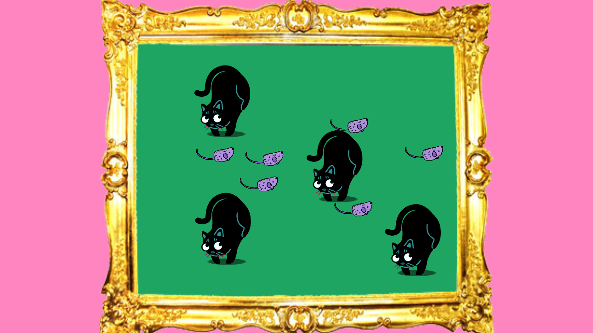

# Miautastic

Devtober attempt used as an opportunity for learning Zenject framework. It's mini arcade game where you pick up dead mice by left mouse button. Make sure there are not too many of them on board. You can also click on cats to move them away. 

Esthetics inspired by Rau's video clip for 'Mistrz Sztuki' and 【Ｖａｐｏｒｗａｖｅ】 

Music by Stevia Spere:
https://steviasphere.bandcamp.com 

Project uses Unity 2017.3.0, Zenject and TextMesh Pro asset.

Executable files:

Windows: 
https://my.pcloud.com/publink/show?code=XZHFAM7ZndLUecp86dX4b3nO4y5uA0QUBc27

Linux:
https://my.pcloud.com/publink/show?code=XZSFAM7ZjbRsOGiqMGhRqK53dWCL4JWuwwk7

Android:
https://my.pcloud.com/publink/show?code=XZeFAM7ZChuVYul4IBJd3AcqVJsYaVgUjkQ7